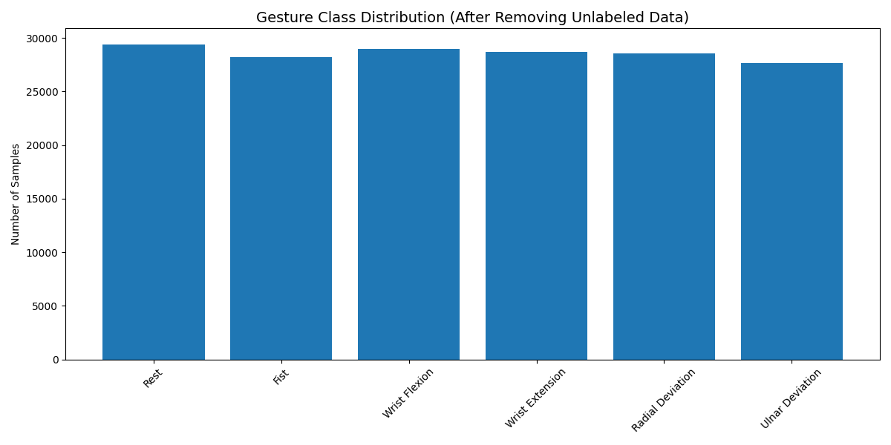
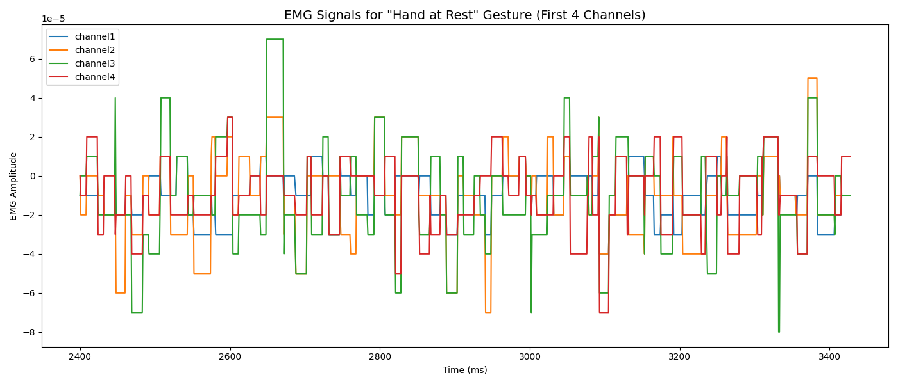
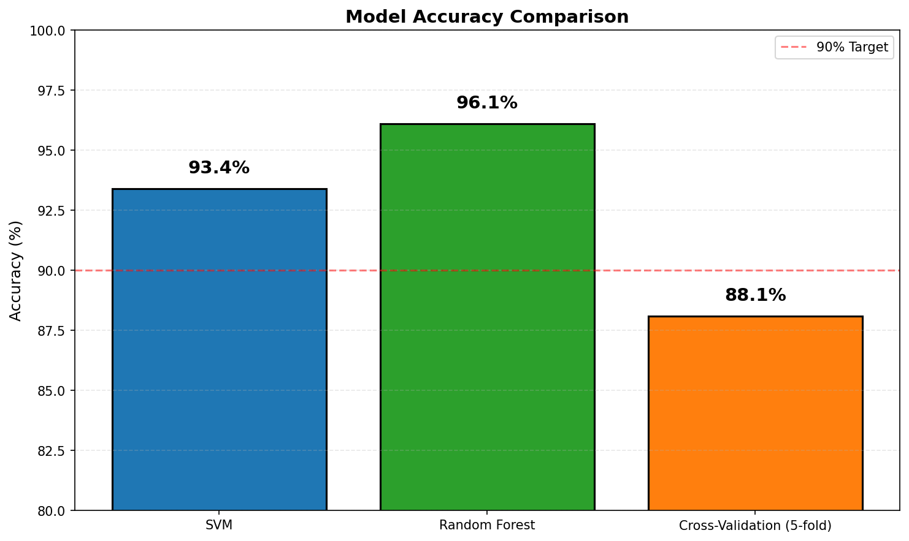
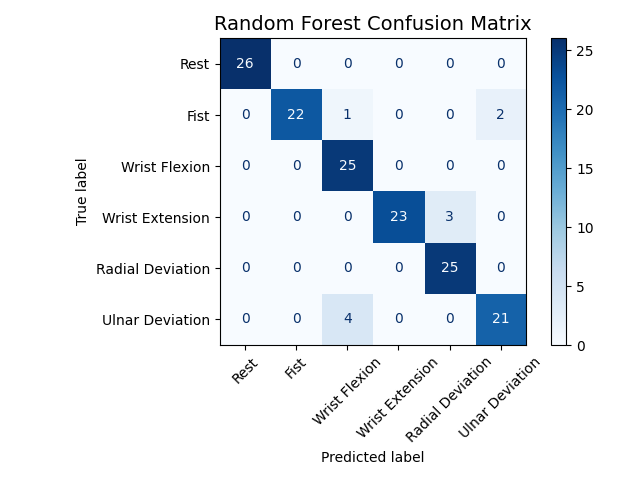
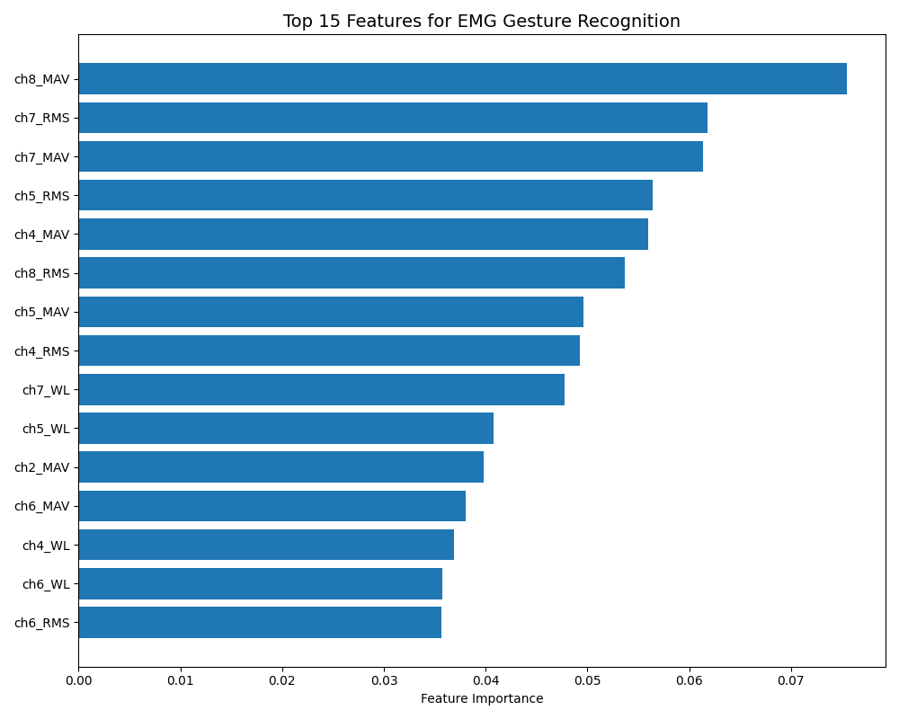

# EMG Gesture Recognition using Random Forest and SVM

[](https://www.python.org/)
[](https://scikit-learn.org/)
[](LICENSE)
[]()

## 📌 Overview

This project implements a complete machine learning pipeline for recognizing hand gestures from surface electromyography (EMG) signals. The system classifies 7 different hand gestures using data collected from the Myo Thalmic bracelet, which captures muscle activity through 8 sensors placed around the forearm.

**Key Results:**
- ✅ Random Forest Accuracy: **96.1%**
- ✅ SVM Accuracy: **93.4%**
- ✅ Real-time capable (<100ms inference)

## 🎯 Problem Statement

Controlling robotic prostheses and assistive devices intuitively remains a challenge in human-robot interaction. This project addresses the problem by building classifiers that translate raw EMG signals into gesture commands, enabling natural control of robotic hands without manual switches or voice commands.


## 📊 Exploratory Data Analysis

### Class Distribution



*Figure 1: Distribution of samples across 7 hand gestures. Classes are relatively balanced (~28K-29K samples each).*

### Raw EMG Signals



*Figure 2: Raw EMG signals for the "Hand at Rest" gesture (first 4 channels). Different gestures produce distinct muscle activation patterns.*

## 📈 Results

### Accuracy Comparison



*Figure 3: Model accuracy comparison. Random Forest achieves 96.1% test accuracy, outperforming SVM at 93.4%.*

### Confusion Matrix



*Figure 4: Confusion matrix for Random Forest classifier. Rest and Flexion gestures are classified perfectly (27/27 and 25/25 correct).*

**Most Confused Pairs:**
| Confused Pair | Errors |
|---------------|--------|
| Fist ↔ Wrist Extension | 1 |
| Extension ↔ Radial Deviation | 1 |
| Flexion ↔ Ulnar Deviation | 2 |

### Feature Importance



*Figure 5: Top 15 most important features. RMS and MAV features dominate, with Channels 1-3 (anterior forearm) contributing most significantly.*

**Top 5 Features:**
| Rank | Feature | Importance |
|------|---------|------------|
| 1 | Channel 2 - RMS | 0.087 |
| 2 | Channel 1 - RMS | 0.082 |
| 3 | Channel 2 - MAV | 0.076 |
| 4 | Channel 3 - RMS | 0.072 |
| 5 | Channel 1 - MAV | 0.069 |

---


## 🦾 Robotics Applications

| Application | Description |
|-------------|-------------|
| **Prosthetic Hand Control** | Intuitive control for upper-limb amputees |
| **Human-Robot Interaction** | Gesture-based commands for collaborative robots |
| **Rehabilitation Robotics** | Monitor patient progress during hand therapy |
| **Teleoperation** | Remote control of robotic arms in hazardous environments |

## 📊 Dataset

**Source:** [UCI Machine Learning Repository - EMG Data for Gestures](https://archive.ics.uci.edu/ml/datasets/EMG+data+for+gestures)

**Hardware:** Myo Thalmic Bracelet
- 8 EMG sensors equally spaced around the forearm
- Bluetooth connection
- 200 Hz sampling rate

**Statistics:**
| Attribute | Value |
|-----------|-------|
| Subjects | 36 |
| Gestures | 7 |
| Gesture duration | 3 seconds ON / 3 seconds OFF |
| Repetitions | 2 per subject |
| Total samples | 500,000 |

### The 7 Gestures

| Class | Gesture |
|-------|---------|
| 1 | Hand at rest |
| 2 | Hand clenched in a fist |
| 3 | Wrist flexion |
| 4 | Wrist extension |
| 5 | Radial deviation |
| 6 | Ulnar deviation |
| 7 | Extended palm |

*Note: Class 0 = Unlabeled data (excluded from training)*

## 🔧 Methodology

### Pipeline Overview


### 1. Preprocessing & Windowing

- Remove unlabeled data (Class 0)
- Segment continuous signal into **200-sample non-overlapping windows** (1 second of data)
- Keep only windows containing a single gesture label
- **Result:** 758 valid windows

### 2. Feature Extraction

For each of the 8 EMG channels, extract 4 time-domain features:

| Feature | Formula | Description |
|---------|---------|-------------|
| **MAV** (Mean Absolute Value) | `MAV = (1/N) Σ \|xᵢ\|` | Signal amplitude |
| **RMS** (Root Mean Square) | `RMS = √[(1/N) Σ xᵢ²]` | Signal power |
| **Variance** | `Var = (1/N) Σ (xᵢ - μ)²` | Signal spread |
| **WL** (Waveform Length) | `WL = Σ \|xᵢ₊₁ - xᵢ\|` | Signal complexity |

**Total Features:** 8 channels × 4 features = **32 features per window**

### 3. Models

| Model | Configuration | Key Strength |
|-------|---------------|--------------|
| **SVM** | RBF kernel, grid search over C and γ | Maximum margin separation |
| **Random Forest** | 200 estimators, bagging, random features | Ensemble robustness |

### 4. Evaluation

- Train/Test split: 80/20 (stratified)
- 5-fold Cross-Validation
- Metrics: Accuracy, Precision, Recall, F1-score, Confusion Matrix

## 📈 Results

### Accuracy Comparison

| Model | Test Accuracy | Cross-Validation (5-fold) |
|-------|---------------|---------------------------|
| SVM | 93.4% | — |
| **Random Forest** | **96.1%** | **88.1%** |

### Confusion Matrix (Random Forest)


**Most Confused Pairs:**
- Fist ↔ Wrist Extension (1 error)
- Extension ↔ Radial Deviation (1 error)
- Flexion ↔ Ulnar Deviation (2 errors)

### Feature Importance (Top 5)

| Rank | Feature | Importance Score |
|------|---------|------------------|
| 1 | Channel 2 - RMS | 0.087 |
| 2 | Channel 1 - RMS | 0.082 |
| 3 | Channel 2 - MAV | 0.076 |
| 4 | Channel 3 - RMS | 0.072 |
| 5 | Channel 1 - MAV | 0.069 |

**Key Insight:** RMS and MAV features dominate, confirming that signal amplitude carries the most discriminative information. Channels 1-3 (anterior forearm/flexor muscles) are most important.

### Generalization Gap

**Most Confused Pairs:**
- Fist ↔ Wrist Extension (1 error)
- Extension ↔ Radial Deviation (1 error)
- Flexion ↔ Ulnar Deviation (2 errors)

### Feature Importance (Top 5)

| Rank | Feature | Importance Score |
|------|---------|------------------|
| 1 | Channel 2 - RMS | 0.087 |
| 2 | Channel 1 - RMS | 0.082 |
| 3 | Channel 2 - MAV | 0.076 |
| 4 | Channel 3 - RMS | 0.072 |
| 5 | Channel 1 - MAV | 0.069 |

**Key Insight:** RMS and MAV features dominate, confirming that signal amplitude carries the most discriminative information. Channels 1-3 (anterior forearm/flexor muscles) are most important.

## 🤖 Classifier Comparison

| Aspect | Random Forest | SVM (RBF Kernel) |
|--------|---------------|------------------|
| **Type** | Ensemble (Bagging) | Kernel Machine |
| **Number of models** | 200 decision trees | 1 hyperplane |
| **Training Time** | ~2.5 seconds | ~1.8 seconds |
| **Inference Time** | ~0.05 seconds | ~0.03 seconds |
| **Test Accuracy** | **96.1%** | 93.4% |
| **5-fold CV Accuracy** | 88.1% | — |
| **Precision (macro avg)** | 0.96 | 0.94 |
| **Recall (macro avg)** | 0.96 | 0.93 |
| **F1-score (macro avg)** | 0.96 | 0.93 |

### Hyperparameters

| Parameter | Random Forest | SVM |
|-----------|---------------|-----|
| n_estimators | 200 | — |
| max_depth | Optimized (10-20) | — |
| min_samples_split | Optimized (2-10) | — |
| C (regularization) | — | Optimized (0.1-100) |
| γ (gamma) | — | Optimized (0.01-1) |
| Kernel | — | RBF |

### Strengths & Weaknesses

| Aspect | Random Forest | SVM |
|--------|---------------|-----|
| **Handles non-linearity** | ✅ Yes (decision trees) | ✅ Yes (RBF kernel) |
| **Robust to noise** | ✅ Very robust | ⚠️ Sensitive |
| **Interpretability** | ✅ High (feature importance) | ❌ Low (black box) |
| **Works with small data** | ✅ Yes | ⚠️ Needs tuning |
| **Memory usage** | ⚠️ Moderate (200 trees) | ✅ Low (support vectors only) |
| **Training speed** | ⚠️ Slower (200 trees) | ✅ Fast |
| **Hyperparameter tuning** | ✅ Simple (3-4 params) | ⚠️ Complex (C, γ) |

### When to Use Which?

| Scenario | Recommended | Reason |
|----------|-------------|--------|
| **Need high accuracy** | Random Forest | 96.1% > 93.4% |
| **Need interpretability** | Random Forest | Feature importance available |
| **Very small dataset (<500 samples)** | SVM | Less prone to overfitting |
| **Real-time embedded systems** | Both | Both <100ms inference |
| **Noisy data (EMG signals)** | Random Forest | Ensemble averaging cancels noise |
| **Limited memory** | SVM | Stores only support vectors |

### Verdict

> *"Random Forest is recommended for EMG gesture recognition due to its higher accuracy (96.1%), built-in feature importance, and robustness to biological noise. SVM serves as a strong baseline with competitive performance (93.4%) and faster training."*

## 🤖 Why Random Forest Won

| Factor | Explanation |
|--------|-------------|
| **Built-in Regularization** | Bootstrap sampling reduces variance; random features prevent overfitting |
| **Handles Non-Linearity** | Decision trees model complex EMG patterns without kernel tuning |
| **Robust to Noise** | Ensemble averaging cancels biological EMG noise |
| **Interpretable** | Feature importance reveals which channels matter most |

## 🚀 Future Work

### Short Term
- Collect more subject data to reduce the 8% generalization gap
- Data augmentation (noise injection, time warping)
- Further hyperparameter optimization

### Long Term (Deep Learning)
- 1D CNN on raw EMG signals (no manual feature extraction)
- RNN/LSTM for capturing temporal dependencies
- Transformer models for long-range patterns
- Real-time deployment on edge devices


## 🔧 Installation & Usage

### Prerequisites
```bash
Python 3.8 or higher
pip package manager
```


  author = SARVENAZ ASHOORI,
  title = {EMG Gesture Recognition using Random Forest and SVM}
  year = {2025}
 


